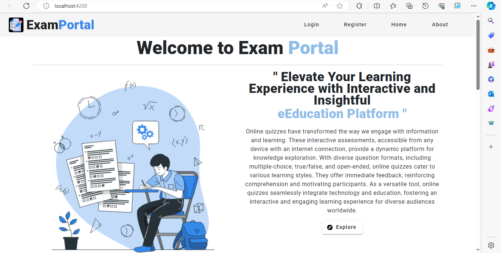

 
# ExamPortal 🖥️

**ExamPortal** is a web application designed for conducting exams online. It allows users to perform CRUD (Create, Read, Update, Delete) operations related to exams. The system features both normal user and admin logins, enabling users to take exams and administrators to manage all aspects of the examination process. 
 
 
## Home page Screenshot 📸

 

## Features🌟
### User Authentication🔐

- Normal users can log in to the system with their credentials.
- Admin users have a separate login to access administrative functionalities.
### CRUD Operations⚙️

- Create, Read, Update, and Delete operations are available for managing exams.
### Exam Taking🎓
- Normal users can take exams through the portal.
- The system supports various types of questions (e.g., multiple choice, true/false).
### Admin Dashboard🖥️

- Admin users have access to a dashboard for managing exams and user data.

## Usage📑
### User Login🌐

- Access the application as a normal user using the provided login credentials.
### Admin Login🌐

- Log in as an admin to access the admin dashboard.
Exam Management:

- Create, update, and delete exams through the admin dashboard.
### User Exam📋

- Normal users can take exams through the user portal.

## Technologies Used👨‍💻
**Angular,BootStrap:** Front-end framework for building the user interface.

**Java:** Back-end technologies for handling server-side operations.

**MySql:** Database for storing exam and user data.

**Spring security:** Implemented for user  authentication for secure access.

## Contributing🥇

Contributions are always welcome!

 
If you want to contribute to the development of the ExamPortal project, follow these steps:

See [contributing.md](https://contributing.md/) for ways to get started.

 ## or can start like...🛩️
1. Fork the repository.
2. Create a new branch (git checkout -b feature/new-feature).
3. Commit your changes (git commit -m 'Add new feature').
4. Push to the branch (git push origin feature/new-feature).
5. Open a pull request.

## 🔗 Contact Me 📱

 

 
 
 

# Thank You!💟 
